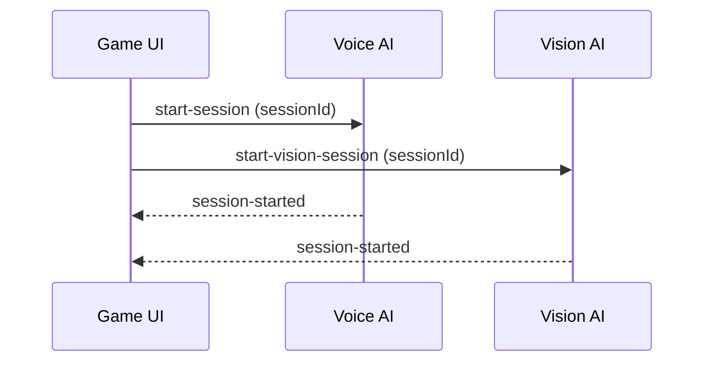
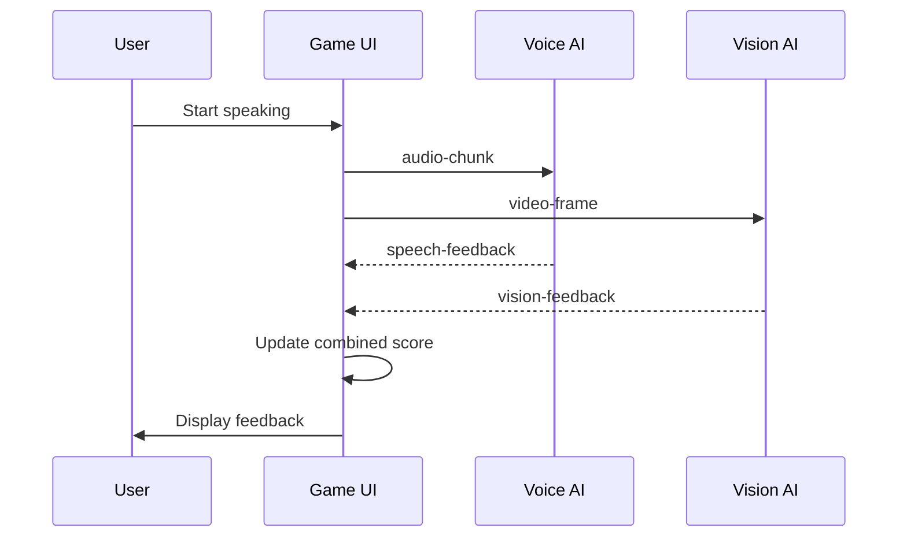
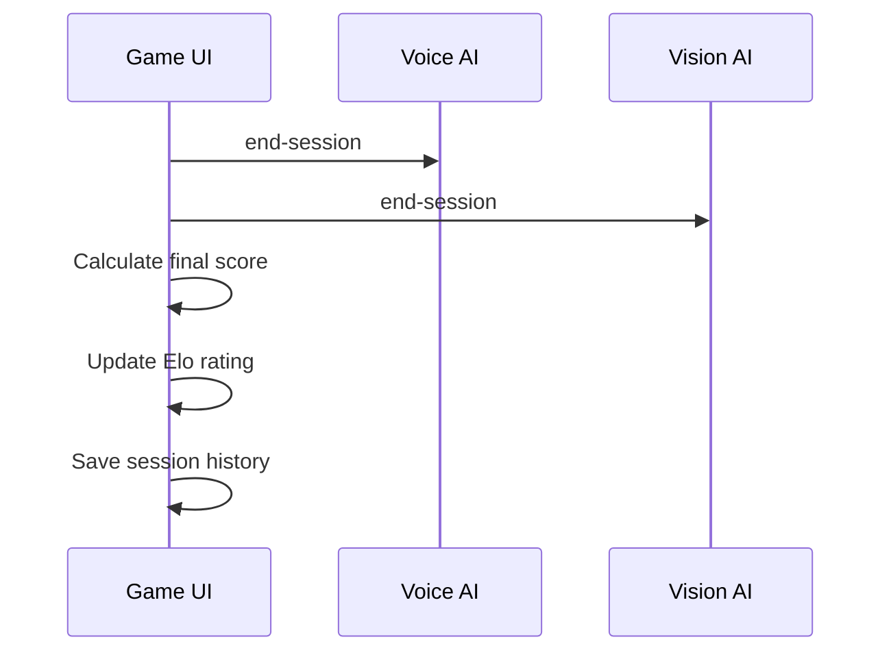

# 🔗 Eloquence.AI Integration Guide

This guide explains how the three modules of Eloquence.AI communicate and work together to provide real-time public speaking feedback.

## 🏗️ Architecture Overview

```
┌─────────────────┐    WebSocket    ┌─────────────────┐
│   Game UI       │ ◄──────────────► │   Voice AI      │
│   (Port 3003)   │                 │   (Port 3001)   │
└─────────────────┘                 └─────────────────┘
         │                                   │
         │ WebSocket                         │
         ▼                                   │
┌─────────────────┐                          │
│  Vision AI      │ ◄────────────────────────┘
│  (Port 3002)    │
└─────────────────┘
```

## 📡 Communication Protocols

### 1. WebSocket Messages

All modules communicate via WebSocket using standardized message formats defined in `shared/schemas.ts`.

**Message Types:**
- `speech_feedback` - Voice analysis results
- `visual_feedback` - Visual analysis results
- `performance_update` - Combined performance metrics
- `audience_reaction` - Simulated audience responses
- `elo_update` - Rating changes

### 2. HTTP API Endpoints

**Voice AI Endpoints:**
```typescript
POST /analyze-speech
{
  audioData: Buffer,
  sessionId: string
}

POST /stream-speech
{
  audioChunk: Buffer,
  sessionId: string,
  isFinal: boolean
}
```

**Vision AI Endpoints:**
```typescript
POST /analyze-frame
{
  imageData: string, // base64 encoded
  sessionId: string
}

POST /stream-video
{
  frameData: string,
  sessionId: string,
  isKeyFrame: boolean
}
```

## 🔄 Data Flow

### 1. Session Initialization



### 2. Real-time Feedback Loop



### 3. Session Completion



## 📊 Data Schemas

### Speech Feedback Schema
```typescript
interface SpeechFeedback {
  timestamp: number;
  transcript: string;
  confidence: number;
  tone: {
    emotion: 'confident' | 'nervous' | 'enthusiastic' | 'monotone' | 'engaging';
    score: number;
  };
  pace: {
    wordsPerMinute: number;
    pauses: number;
    score: number;
  };
  fillerWords: {
    count: number;
    words: string[];
    score: number;
  };
  clarity: {
    pronunciation: number;
    volume: number;
    articulation: number;
    overall: number;
  };
  feedback: {
    positive: string[];
    improvements: string[];
    suggestions: string[];
  };
  overallScore: number;
}
```

### Visual Feedback Schema
```typescript
interface VisualFeedback {
  timestamp: number;
  eyeContact: {
    percentage: number;
    duration: number;
    score: number;
  };
  facialExpression: {
    emotion: 'confident' | 'nervous' | 'engaged' | 'distracted' | 'neutral';
    confidence: number;
    score: number;
  };
  posture: {
    stance: 'good' | 'slouched' | 'leaning' | 'rigid';
    score: number;
  };
  gestures: {
    detected: string[];
    appropriateness: number;
    frequency: number;
    score: number;
  };
  bodyLanguage: {
    openness: number;
    energy: number;
    engagement: number;
    overall: number;
  };
  feedback: {
    positive: string[];
    improvements: string[];
    suggestions: string[];
  };
  overallScore: number;
}
```

## 🎯 Integration Points

### 1. WebSocket Connection Management

**Game UI WebSocket Setup:**
```typescript
// Connect to Voice AI
const voiceSocket = io('http://localhost:3001');
voiceSocket.on('speech-feedback', (feedback) => {
  setSpeechFeedback(feedback);
});

// Connect to Vision AI
const visionSocket = io('http://localhost:3002');
visionSocket.on('vision-feedback', (feedback) => {
  setVisualFeedback(feedback);
});
```

### 2. Real-time Data Synchronization

**State Management:**
```typescript
// Using Zustand store for real-time updates
const useGameStore = create((set) => ({
  speechFeedback: null,
  visualFeedback: null,
  audienceReaction: null,
  
  setSpeechFeedback: (feedback) => set({ speechFeedback: feedback }),
  setVisualFeedback: (feedback) => set({ visualFeedback: feedback }),
  setAudienceReaction: (reaction) => set({ audienceReaction: reaction }),
}));
```

### 3. Score Calculation

**Combined Performance Score:**
```typescript
function calculateCombinedScore(speech: SpeechFeedback, visual: VisualFeedback): number {
  const weights = {
    speech: 0.4,
    visual: 0.4,
    audience: 0.2
  };
  
  return Math.round(
    speech.overallScore * weights.speech +
    visual.overallScore * weights.visual +
    audienceReaction.positiveFeedback * weights.audience
  );
}
```

## 🔧 Configuration

### Environment Variables

**Game UI (.env):**
```env
NEXT_PUBLIC_VOICE_AI_URL=http://localhost:3001
NEXT_PUBLIC_VISION_AI_URL=http://localhost:3002
NEXT_PUBLIC_WS_URL=ws://localhost:3001
```

**Voice AI (.env):**
```env
PORT=3001
OPENAI_API_KEY=your_openai_key
ANTHROPIC_API_KEY=your_anthropic_key
CORS_ORIGIN=http://localhost:3003
```

**Vision AI (.env):**
```env
PORT=3002
CORS_ORIGIN=http://localhost:3003
```

### CORS Configuration

**Voice AI:**
```typescript
const io = new Server(server, {
  cors: {
    origin: ["http://localhost:3003"],
    methods: ["GET", "POST"]
  }
});
```

**Vision AI:**
```typescript
const io = new Server(server, {
  cors: {
    origin: ["http://localhost:3003"],
    methods: ["GET", "POST"]
  }
});
```

## 🧪 Testing Integration

### 1. Unit Tests

**Test WebSocket connections:**
```typescript
describe('WebSocket Integration', () => {
  it('should connect to Voice AI', async () => {
    const socket = io('http://localhost:3001');
    await new Promise(resolve => socket.on('connect', resolve));
    expect(socket.connected).toBe(true);
  });
});
```

### 2. Integration Tests

**Test complete feedback loop:**
```typescript
describe('Feedback Loop', () => {
  it('should process speech and visual feedback', async () => {
    // Send test audio data
    const audioData = Buffer.from('test audio');
    const response = await fetch('http://localhost:3001/analyze-speech', {
      method: 'POST',
      body: JSON.stringify({ audioData, sessionId: 'test' })
    });
    
    expect(response.status).toBe(200);
    const feedback = await response.json();
    expect(feedback.overallScore).toBeGreaterThan(0);
  });
});
```

### 3. End-to-End Tests

**Test complete user session:**
```typescript
describe('Complete Session', () => {
  it('should handle full speaking session', async () => {
    // Start session
    // Send audio/video data
    // Receive feedback
    // Calculate final score
    // Update Elo rating
  });
});
```

## 🚨 Error Handling

### 1. Connection Failures

**Reconnection Logic:**
```typescript
const socket = io('http://localhost:3001', {
  reconnection: true,
  reconnectionAttempts: 5,
  reconnectionDelay: 1000
});

socket.on('disconnect', () => {
  console.log('Disconnected from Voice AI');
});

socket.on('reconnect', () => {
  console.log('Reconnected to Voice AI');
});
```

### 2. Data Validation

**Schema Validation:**
```typescript
import { SpeechFeedback } from '../shared/schemas';

function validateSpeechFeedback(data: any): SpeechFeedback | null {
  try {
    // Validate required fields
    if (!data.timestamp || !data.transcript) {
      return null;
    }
    return data as SpeechFeedback;
  } catch (error) {
    console.error('Invalid speech feedback data:', error);
    return null;
  }
}
```

### 3. Fallback Mechanisms

**Graceful Degradation:**
```typescript
// If Voice AI is unavailable, use mock data
if (!voiceSocket.connected) {
  setSpeechFeedback(getMockSpeechFeedback());
}

// If Vision AI is unavailable, skip visual analysis
if (!visionSocket.connected) {
  console.warn('Vision AI unavailable, skipping visual analysis');
}
```

## 📈 Performance Optimization

### 1. Data Batching

**Batch WebSocket messages:**
```typescript
const messageQueue: WebSocketMessage[] = [];
const BATCH_SIZE = 10;
const BATCH_INTERVAL = 100; // ms

setInterval(() => {
  if (messageQueue.length > 0) {
    const batch = messageQueue.splice(0, BATCH_SIZE);
    broadcastBatch(batch);
  }
}, BATCH_INTERVAL);
```

### 2. Caching

**Cache frequent responses:**
```typescript
const feedbackCache = new Map<string, SpeechFeedback>();

function getCachedFeedback(sessionId: string): SpeechFeedback | null {
  return feedbackCache.get(sessionId) || null;
}
```

### 3. Compression

**Compress WebSocket messages:**
```typescript
import { compress, decompress } from 'lz-string';

// Compress before sending
const compressed = compress(JSON.stringify(data));
socket.emit('feedback', compressed);

// Decompress on receive
socket.on('feedback', (compressedData) => {
  const decompressed = decompress(compressedData);
  const data = JSON.parse(decompressed);
  handleFeedback(data);
});
```

## 🔄 Deployment Integration

### 1. Production URLs

**Update environment variables:**
```env
NEXT_PUBLIC_VOICE_AI_URL=https://voice-ai.eloquence.ai
NEXT_PUBLIC_VISION_AI_URL=https://vision-ai.eloquence.ai
NEXT_PUBLIC_WS_URL=wss://voice-ai.eloquence.ai
```

### 2. Load Balancing

**Multiple instances:**
```typescript
const voiceAIServers = [
  'https://voice-ai-1.eloquence.ai',
  'https://voice-ai-2.eloquence.ai'
];

const currentServer = voiceAIServers[Math.floor(Math.random() * voiceAIServers.length)];
```

### 3. Health Checks

**Monitor service health:**
```typescript
async function checkServiceHealth() {
  const services = [
    'http://localhost:3001/health',
    'http://localhost:3002/health'
  ];
  
  for (const service of services) {
    try {
      const response = await fetch(service);
      if (!response.ok) {
        console.error(`Service unhealthy: ${service}`);
      }
    } catch (error) {
      console.error(`Service unavailable: ${service}`);
    }
  }
}
```

---

This integration guide provides the foundation for connecting all three modules of Eloquence.AI. Follow the patterns and examples to ensure smooth communication between components. 